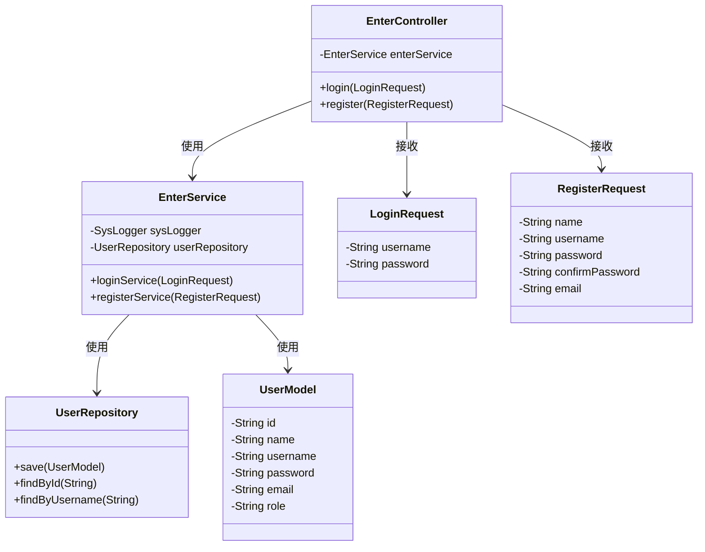
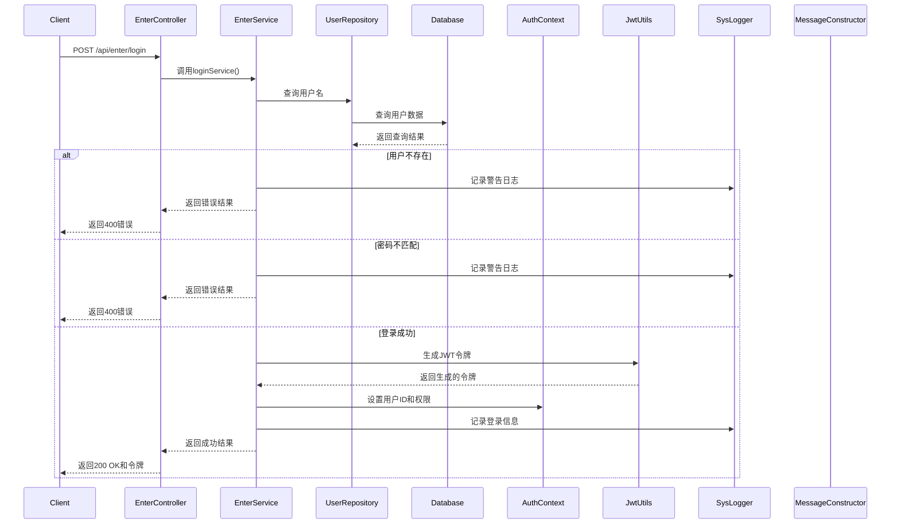
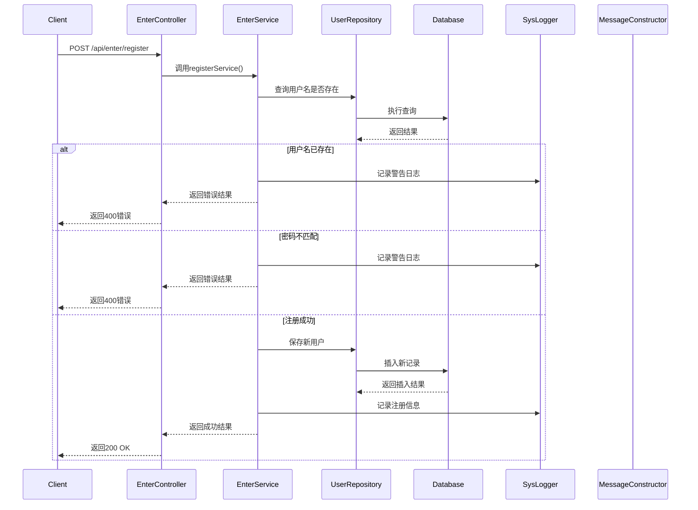

# EnterController工作流程分析

## 1. 整体架构

EnterController主要处理用户登录和注册功能，是系统的入口控制器。它通过REST API接收客户端请求，并将请求转发给EnterService进行业务处理。

## 2. 类图

## 3. 登录工作流程

### 3.1 序列图

### 3.2 工作步骤
1. 客户端发送POST请求到`/api/enter/login`接口，携带用户名和密码
2. EnterController接收请求，调用EnterService的loginService方法
3. EnterService执行以下操作：
   - 调用UserRepository根据用户名查询用户
   - 如果用户不存在，返回错误
   - 如果密码不匹配，返回错误
   - 生成JWT令牌
   - 设置用户权限
   - 记录登录日志
   - 返回包含令牌的成功响应

## 4. 注册工作流程

### 4.1 序列图

### 4.2 工作步骤
1. 客户端发送POST请求到`/api/enter/register`接口，携带注册信息（姓名、用户名、密码、确认密码、邮箱）
2. EnterController接收请求，调用EnterService的registerService方法
3. EnterService执行以下操作：
   - 检查用户名是否已存在
   - 检查密码和确认密码是否一致
   - 创建新的UserModel对象并设置属性
   - 调用UserRepository保存用户
   - 记录注册日志
   - 返回成功响应

## 5. 核心组件说明

### 5.1 EnterController
- 控制器类，负责接收HTTP请求
- 提供两个API接口：
  - `POST /api/enter/login`：处理登录请求
  - `POST /api/enter/register`：处理注册请求
- 将请求委托给EnterService处理

### 5.2 EnterService
- 服务类，实现登录和注册的核心业务逻辑
- 依赖项：
  - SysLogger：用于记录日志
  - UserRepository：用于访问数据库
- 主要方法：
  - loginService()：处理登录业务
  - registerService()：处理注册业务

### 5.3 UserRepository
- 数据访问接口，继承自JpaRepository
- 提供标准的CRUD操作
- 自定义方法：
  - findByUsername()：根据用户名查找用户

### 5.4 UserModel
- 用户实体类，映射到数据库表`user`
- 包含以下字段：
  - id：用户ID（UUID）
  - name：用户姓名
  - username：登录用户名
  - password：登录密码
  - email：邮箱地址
  - role：用户角色（admin或common）

## 6. 日志记录

EnterService使用SysLogger记录详细的登录和注册信息：
- 登录尝试（成功或失败）
- 注册尝试（成功或失败）
- 使用MessageConstructor构造格式化的日志消息

## 7. 安全性

- 使用JWT进行身份验证
- 根据用户角色分配不同权限
  - admin：管理员权限
  - common：普通用户权限
- 密码以明文形式存储（当前实现，建议在生产环境中改为哈希存储）